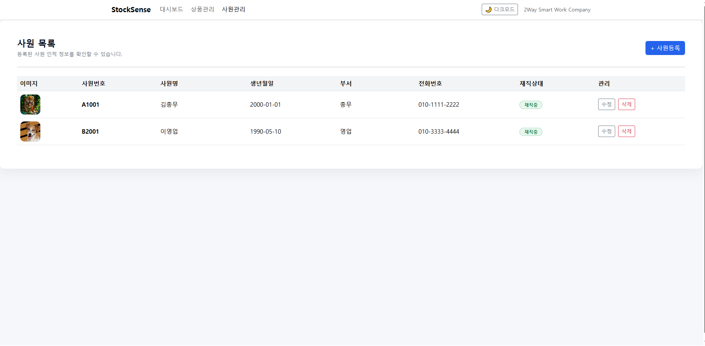

#  StockSense

사원 관리 기능을 중심으로 구현한 CRUD 기반 웹 관리 시스템입니다.

---

##  프로젝트 소개
StockSense는 사원 정보를 효율적으로 관리하기 위해  
등록(Create), 조회(Read), 수정(Update), 삭제(Delete) 기능을 구현한 웹 애플리케이션입니다.

실제 기업의 인사 관리 시스템(HR)의 기본 구조를 이해하고,  
데이터 흐름 및 계층 구조 설계를 경험하는 것을 목표로 개발했습니다.

---

##  사용 기술
- Backend: Java, Spring Boot
- Frontend: HTML, CSS, JavaScript
- Database: (사용 DB 입력 ex. MySQL)
- Build Tool: Gradle

---

##  주요 기능

###  사원 관리 (✔ 담당)
- 사원 등록 (Create)
- 사원 목록 조회 (Read)
- 사원 정보 수정 (Update)
- 사원 삭제 (Delete)
- 사원 목록 테이블 출력
- 재직 상태 표시 (예: 재직중)
- 부서 / 연락처 등 상세 정보 관리

---

##  실행 화면

###  사원 목록
- 등록된 사원 정보를 테이블 형태로 확인 가능
- 수정 / 삭제 버튼을 통해 데이터 관리
- 재직 상태를 시각적으로 표시



---

##  담당 역할
- 사원 관리 CRUD 기능 전체 구현
- Employee DTO 설계 및 데이터 전달 구조 구성
- Controller / Service / Repository 계층 구조 설계
- 사용자 입력 처리 및 유효성 검사 구현
- UI 화면 구성 및 기능 연결

---

##  실행 방법
```bash
git clone https://github.com/yourusername/stocksense.git
cd stocksense
./gradlew bootRun
